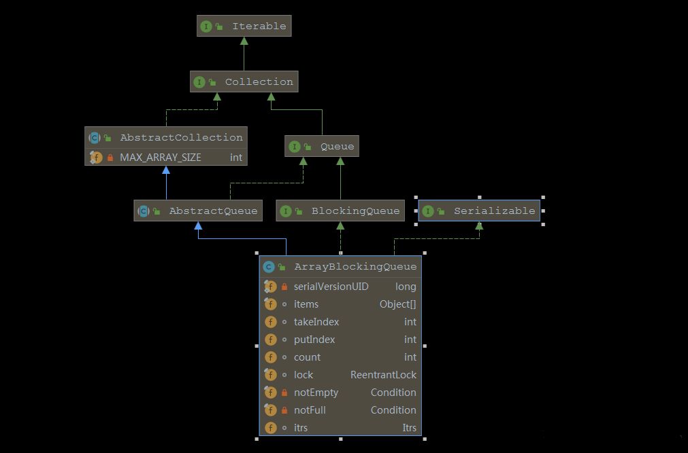

**ArrayBlockingQueue**

**一：简介**

​ 是一个用数组实现的有界阻塞队列，此队列按照先进先出（FIFO）的原则对元素进行排序。支持公平锁和非公平锁，默认为非公平策略。

​ “有界”，则是指 ArrayBlockingQueue 对应的数组是有界限且固定的，在创建对象时由构造函数指定，一旦指定则无法更改。

​ “阻塞队列”，是指多线程访问竞争资源时，当竞争资源已被某线程获取时，其它要获取该资源的线程需要阻塞等待；

“FIFO（先进先出）”，原则对元素进行排序，元素都是从尾部插入到队列，从头部开始返回。

**二：使用场景**

.jpg>)

​ 生产者消费者模型中，生产数据和消费数据的速率不一致，如果生产数据速度快一些，消费(处理)不过来，就会导致数据丢失。这时候我们就可以应用上阻塞队列来解决这个问题。

**三：结构关系**



**四：源码解析**

​ **3.1、参数**

```java
// 存储队列元素的数组
final Object[] items;

// 拿数据的索引，用于take，poll，peek，remove方法
int takeIndex;

// 放数据的索引，用于put，offer，add方法
int putIndex;

// 元素个数
int count;

// 可重入锁（全局）
final ReentrantLock lock;

// notEmpty条件对象，由lock创建 （非空条件队列：当队列空时，线程在该队列等待获取）
private final Condition notEmpty;

// notFull条件对象，由lock创建 （非满条件队列：当队列满时，线程在该队列等待插入）
private final Condition notFull;
```

​

​ **3.2、构造器**

```java
/**
 * 指定队列初始容量的构造器
 */
public ArrayBlockingQueue(int capacity) {
    this(capacity, false);//默认构造非公平锁的阻塞队列
}
/**
 * 指定队列初始容量和公平/非公平策略的构造器
 */
public ArrayBlockingQueue(int capacity, boolean fair) {
    if (capacity <= 0)
        throw new IllegalArgumentException();
    this.items = new Object[capacity];
    //初始化ReentrantLock重入锁，出队入队拥有这同一个锁
    lock = new ReentrantLock(fair);
    //初始化非空等待队列
    notEmpty = lock.newCondition();
    //初始化非满等待队列
    notFull =  lock.newCondition();
}
/**
 * 根据已有集合构造队列
 */
public ArrayBlockingQueue(int capacity, boolean fair,
                          Collection<? extends E> c) {
    this(capacity, fair);
    final ReentrantLock lock = this.lock;
    lock.lock(); // Lock only for visibility, not mutual exclusion
    try {
        int i = 0;
        //将集合添加进数组构成的队列中
        try {
            for (E e : c) {
                checkNotNull(e);
                items[i++] = e;
            }
        } catch (ArrayIndexOutOfBoundsException ex) {
            throw new IllegalArgumentException();
        }
        count = i;
        putIndex = (i == capacity) ? 0 : i;  // 如果队列已满，则重置putIndex为0
    } finally {
        lock.unlock();
    }
}
```

​ 核心就是第二种构造器，从构造器也可以看出，ArrayBlockingQueue 在构造时就指定了内部数组的大小，并通过 ReentrantLock 来保证并发环境下的线程安全，参数 fair 公平/非公平策略

​ 第三种构造函数，根据已有集合构造队列，其中在 28 行，可以看到源码有一行注释，意思是：这个锁的操作并不是为了互斥操作，而是锁住其可见性。【线程 T1 是实例化 ArrayBlockingQueue 对象，T2 是对实例化的 ArrayBlockingQueue 对象做入队操作（当然要保证 T1 和 T2 的执行顺序），如果不对它进行加锁操作（加锁会保证其可见性，也就是写回主存），T1 的集合 c 有可能只存在 T1 线程维护的缓存中，并没有写回主存，T2 中实例化的 ArrayBlockingQueue 维护的缓存以及主存中并没有集合 c，此时就因为可见性造成数据不一致的情况，引发线程安全问题。】

​ **3.3、函数**

```java
// 将指定的元素插入到此队列的尾部（如果立即可行且不会超过该队列的容量），在成功时返回 true，如果此队列已满，则抛出IllegalStateException。
boolean add(E e)

// 将指定的元素插入到此队列的尾部（如果立即可行且不会超过该队列的容量），在成功时返回 true，如果此队列已满，则返回 false。
boolean offer(E e)

// 将指定的元素插入此队列的尾部，如果该队列已满，则在到达指定的等待时间之前等待可用的空间。
boolean offer(E e, long timeout, TimeUnit unit)

// 获取但不移除此队列的头；如果此队列为空，则返回 null。
E peek()

// 获取并移除此队列的头，如果此队列为空，则返回 null。
E poll()

// 获取并移除此队列的头部，在指定的等待时间前等待可用的元素（如果有必要）。
E poll(long timeout, TimeUnit unit)

// 获取并移除此队列的头部，在元素变得可用之前一直等待，也就是说必须要拿到一个元素，除非线程中断。
E take()

// 将指定的元素插入此队列的尾部，如果该队列已满，则等待可用的空间。
void put(E e)

// 从此队列中移除指定元素的单个实例（如果存在）。
boolean remove(Object o)

// 返回在无阻塞的理想情况下（不存在内存或资源约束）此队列能接受的其他元素数量。
int remainingCapacity()

// 返回此队列中元素的数量。
int size()

// 自动移除此队列中的所有元素。
void clear()

// 如果此队列包含指定的元素，则返回 true。
boolean contains(Object o)

// 移除此队列中所有可用的元素，并将它们添加到给定 collection 中。
int drainTo(Collection<? super E> c)

// 最多从此队列中移除给定数量的可用元素，并将这些元素添加到给定 collection 中。
int drainTo(Collection<? super E> c, int maxElements)

// 返回在此队列中的元素上按适当顺序进行迭代的迭代器。
Iterator<E> iterator()

// 返回一个按适当顺序包含此队列中所有元素的数组。
Object[] toArray()

// 返回一个按适当顺序包含此队列中所有元素的数组；返回数组的运行时类型是指定数组的运行时类型。
<T> T[] toArray(T[] a)

// 返回此 collection 的字符串表示形式。
String toString()
```

**常用的操作对比**

| **入队** | **方法名**                              | **队列满时处理方式**                          | **返回值** | **阻塞** |
| -------- | --------------------------------------- | --------------------------------------------- | ---------- | -------- |
| 1        | add(E e)                                | 抛出 IllegalStateException(“Queue full”) 异常 | boolean    | 否       |
| 2        | offer(E e)                              | 返回 false                                    | boolean    | 否       |
| 3        | put(E e)                                | 线程阻塞，直到中断或被唤醒                    | void       | 是       |
| 4        | offer(E e, long timeout, TimeUnit unit) | 在规定时间内重试，超过规定时间返回 false      | boolean    | 是       |

| **出队** | **方法名**                        | **队列满时处理方式**                    | **返回值** | **阻塞** |
| -------- | --------------------------------- | --------------------------------------- | ---------- | -------- |
| 1        | peek()                            | 返回 null                               | E          | 否       |
| 2        | poll()                            | 返回 null                               | E          | 否       |
| 3        | take()                            | 线程阻塞，指定中断或被唤醒              | E          | 是       |
| 4        | poll(long timeout, TimeUnit unit) | 在规定时间内重试，超过规定时间返回 null | E          | 是       |

---


**add/peek 方法**

​ add 向队列种放入元素，其实是调用父类的 add 方法，父类实现中调用 offer 方法，在 offer 方法返回 true 时，add 方法返回 true，否则抛出“Queue full”的异常

```java
public boolean add(E e) {
    return super.add(e);  // 可以看到这里调用的是父类 AbstractQueue 的add方法
}

//AbstractQueue 中 add
public boolean add(E e) {
    if (offer(e)) // 父类实现中调用offer方法
        return true;
    else
        throw new IllegalStateException("Queue full");
}
```

​

​ peek 方法，获取但不移除此队列的头；如果此队列为空，则返回 null

```java
public E peek() {
    final ReentrantLock lock = this.lock;
    lock.lock();
    try {
        return itemAt(takeIndex); // null when queue is empty
    } finally {
        lock.unlock();
    }
}
// 直接返回takeIndex出的数组元素
final E itemAt(int i) {
    return (E) items[i]; // items为该队列，i表示数组下标
}
```

**offer(E)/poll 方法**

​ offer 将指定的元素插入到此队列的尾部（如果立即可行且不会超过该队列的容量），在成功时返回 true，如果此队列已满，则返回 false。

```java
public boolean offer(E e) {
    checkNotNull(e);  // 检查传入参数是否为null
    final ReentrantLock lock = this.lock;
    lock.lock();
    try {
        // cout为队列中元素数量，items为该队列
        if (count == items.length)
            return false;  // 队列满了后返回false，该数据不处理的话会丢失
        else {
            enqueue(e);  // 队列未满的话调用enqueue插入队列，然后返回true，插入成功
            return true;
        }
    } finally {
        lock.unlock();
    }
}
```

​ poll 获取并移除此队列的头，如果此队列为空，则返回 null。

```java
public E poll() {
    final ReentrantLock lock = this.lock;
    lock.lock();
    try {
        // 如果队列中元素数量为0，返回null，有数据时调用dequeue()方法出队
        return (count == 0) ? null : dequeue();
    } finally {
        lock.unlock();
    }
}
```

**offer(E,long,TimeUnit)/poll(long,TimeUnnit)**

​ 比普通 offer/poll 方法区别在于，在队列满时指定了重试时间，如果超过指定的时间后还是无法添加或取出则返回 false。

```java
public boolean offer(E e, long timeout, TimeUnit unit)
    throws InterruptedException {

    checkNotNull(e);
    // 获取超时时间
    long nanos = unit.toNanos(timeout);
    final ReentrantLock lock = this.lock;
    lock.lockInterruptibly();
    try {
        while (count == items.length) {
            if (nanos <= 0)
                return false; // 超过时间后返回false
            // 将当前调用线程挂起，添加到notFull条件队列中等待指定时间唤醒
            nanos = notFull.awaitNanos(nanos);
        }
        enqueue(e); // 入队
        return true;  // 成功后返回true
    } finally {
        lock.unlock();
    }
}

// 取出元素时进行规定时间的重试，超过规定时间则返回null。
public E poll(long timeout, TimeUnit unit) throws InterruptedException {
    long nanos = unit.toNanos(timeout);
    final ReentrantLock lock = this.lock;
    lock.lockInterruptibly();
    try {
        while (count == 0) {
            if (nanos <= 0)
                return null; // 超时后返回null
            // 将当前调用线程挂起，添加到notEmpty条件队列中等待指定时间唤醒
            nanos = notEmpty.awaitNanos(nanos);
        }
        return dequeue(); // 出队
    } finally {
        lock.unlock();
    }
}
```

**put/tack 方法**

​ put 方法是一个阻塞的方法，如果队列元素已满，那么当前线程将会被 notFull 条件对象挂起加到等待队列中，直到队列有空档才会唤醒执行添加操作。但如果队列没有满，那么就直接调用 enqueue(e)方法将元素加入到数组队列中。

最终调用的是 enqueue(E x)方法。其内部通过 putIndex 索引直接将元素添加到数组 items 中，

可以看到，当添加的索引与数组的长度一致时，会把添加索引重新置为 0

.png)

```java
// 阻塞的入参方法
public void put(E e) throws InterruptedException {
    checkNotNull(e);
    final ReentrantLock lock = this.lock;
    lock.lockInterruptibly();
    try {
         // 当队列元素个数与数组长度相等时，无法添加元素.
         // 这里必须用while，防止虚假唤醒,这其实是多线程设计模式中的
         // Guarded Suspension（保护性暂挂模式），之所以这样做，
        // 是防止线程被意外唤醒，不经再次判断就直接调用
        while (count == items.length)
             // 将当前调用线程挂起，添加到notFull条件队列中等待唤醒
            notFull.await();
        enqueue(e);
    } finally {
        lock.unlock();
    }
}

//入队操作
private void enqueue(E x) {
    final Object[] items = this.items;
    //通过putIndex索引对数组进行赋值
    items[putIndex] = x;
    //索引自增，如果已是最后一个位置，重新设置 putIndex = 0;
    if (++putIndex == items.length)
        putIndex = 0;
    // 队列item数组中数量加1
    count++;
    // 添加了元素说明队列有数据，唤醒notEmpty条件对象添加线程，执行取出操作
    notEmpty.signal();
}
```

​ take 方法，有就删除没有就阻塞，注意这个阻塞是可以中断的，如果队列没有数据那么就加入 notEmpty 条件队列等待(有数据就直接取走，方法结束)，如果有新的 put 线程添加了数据，那么 put 操作将会唤醒 take 线程，执行 take 操作


```java
// 阻塞的出参方法
public E take() throws InterruptedException {
    final ReentrantLock lock = this.lock;
    lock.lockInterruptibly();
    try {
        // 当iteem数组中元素为0时，当前调用线程挂起，添加到notEmpty条件队列中等待唤醒
        while (count == 0)
            notEmpty.await();
        return dequeue();
    } finally {
        lock.unlock();
    }
}

//删除队列头元素并返回
private E dequeue() {
    // 拿到当前数组的数据
    final Object[] items = this.items;

    @SuppressWarnings("unchecked")
    // 获取要删除的对象
    E x = (E) items[takeIndex];
    // 将数组中takeIndex索引位置设置为null
    items[takeIndex] = null;
    // takeIndex索引加1并判断是否与数组长度相等，如果相等说明已到尽头，恢复为0
    if (++takeIndex == items.length)
        takeIndex = 0;
    count--; // 队列个数减1
    if (itrs != null)
        itrs.elementDequeued(); // 同时更新迭代器中的元素数据
    // 删除了元素说明队列有空位，唤醒notFull条件对象添加线程，执行添加操作
    notFull.signal();
    return x;
}
```

**remove(Object o)**

​ 从队列中删除指定对象 o，那么就要遍历队列，删除第一个与对象 o 相同的元素，如果队列中没有对象 o 元素，那么返回 false 删除失败。从队列头遍历到队列尾，靠 takeIndex 和 putIndex 两个变量了

```java
// 删除队列中对象o元素，最多删除一条
public boolean remove(Object o) {
  if (o == null) return false;
  final Object[] items = this.items;
  // 使用lock来保证，多线程修改成员属性的安全
  final ReentrantLock lock = this.lock;
  lock.lock();
  try {
    // 当队列中有值的时候，才进行删除。
    if (count > 0) {
      // 队列尾下一个位置
      final int putIndex = this.putIndex;
      // 队列头的位置
      int i = takeIndex;
      do {
        // 当前位置元素与被删除元素相同
        if (o.equals(items[i])) {
          // 删除i位置元素
          removeAt(i);
          // 返回true
          return true;
        }
        if (++i == items.length)
          i = 0;
        // 当i==putIndex表示遍历完所有元素
      } while (i != putIndex);
    }
    return false;
  } finally {
    lock.unlock();
  }
}
```

```java
// 删除队列removeIndex位置的元素
void removeAt(final int removeIndex) {
  // assert lock.getHoldCount() == 1;
  // assert items[removeIndex] != null;
  // assert removeIndex >= 0 && removeIndex < items.length;
  final Object[] items = this.items;
  // 表示删除元素是列表头，就容易多了，与dequeue方法流程差不多
  if (removeIndex == takeIndex) {
    // 移除removeIndex位置元素
    items[takeIndex] = null;
    // 到了数组末尾，就要转到数组头位置
    if (++takeIndex == items.length)
      takeIndex = 0;
    // 队列数量减一
    count--;
    if (itrs != null)
      itrs.elementDequeued();
  } else {
    // an "interior" remove

    final int putIndex = this.putIndex;
    for (int i = removeIndex;;) {
      int next = i + 1;
      if (next == items.length)
        next = 0;
      // 还没有到队列尾，那么就将后一个位置元素覆盖前一个位置的元素
      if (next != putIndex) {
        items[i] = items[next];
        i = next;
      } else {
        // 将队列尾元素置位null
        items[i] = null;
        // 重新设置putIndex的值
        this.putIndex = i;
        break;
      }
    }
    // 队列数量减一
    count--;
    if (itrs != null)
      itrs.removedAt(removeIndex);
  }
  // 因为删除了一个元素，那么队列肯定不满了，那么唤醒在notFull条件下等待的一个线程
  notFull.signal();
}
```

​ 在队列中删除指定位置的元素，需要注意的是删除之后的数组还能保持队列形式

分为两种情况：

1. 如果删除位置是队列头，那么简单，只需要将队列头的位置元素设置为 null，将将队列头位置加一。
2. 如果删除位置不是队列头，那么麻烦了，这个时候，我们就要将从 removeIndex 位置后的元素全部左移一位，覆盖前一个元素。最后将原来队列尾的元素置位 null。

**size() 方法**

​ 获取锁后直接返回 count ，并在返回前释放锁 。

```java
public int size() {
    // 获取独占锁
    final ReentrantLock lock = this.lock;
    lock.lock();
    try {
        // 返回元素个数
        return count;
    } finally {
        // 解锁
        lock.unlock();
    }
}
```

**也许你会问，这里又没有修改 count 的 值，只是简单地获取，为何要加锁呢？**

​ 其实如果 count 被声明为 volatile 的这里就不需要加锁了，因为 volatile 类型的变量保证了 内存的可见性，而 ArrayBlockingQueue 中的 count 并没有被声明为 volatile 的，这是因为 count 操作都是在获取锁后进行的，而获取锁的语义之一是，获取锁后访问的变量都是从主内存获取的，这保证了变量的内存可见性 。

​ **源码分析完后，其实从上面的入队出队操作可以看出，ArrayBlockingQueue 也可以看做是一个环形队列，首先它是有界的，然后它遵循的是先进先出原则，出队入队只需要操作相应的下标，就能构成一个循环**


**ArrayBlockingQueue 用的是同一个锁**

ReentrantLock 和其 Condition 的关系：

​ ReentrantLock 内部维护了一个双向链表，链表上的每个节点都会保存一个线程，锁在双向链表的头部自选，取出线程执行。而 Condition 内部同样维持着一个双向链表，但是其向链表中添加元素（await）和从链表中移除（signal）元素没有像 ReentrantLock 那样，保证线程安全，所以在调用 Condition 的 await()和 signal()方法时，需要在 lock.lock()和 lock.unlock()之间以保证线程的安全。在调用 Condition 的 signal 时，它从自己的双向链表中取出一个节点放到了 ReentrantLock 的双向链表中，所以在具体的运行过程中不管 ReentrantLock new 了几个 Condition 其实内部公用的一把锁。

**五：注意事项**

​ 1.ArrayBlockingQueue 底层基于数组实现，在对象创建时需要指定数组大小。在构建对象时，已经创建了数组。所以使用 Array 需要特别注意设定合适的队列大小，如果设置过大会造成内存浪费。如果设置内存太小，就会影响并发的性能。

​ 2.ArrayBlockingQueue 用的是一把锁，LinkedBlockingQueue 用的是两把锁，大多数场景适合使用 LinkedBlockingQueue。在 JDK 源码当中有说明，LinkedBlockingQueue 比 ArrayBlockingQueue 有更高的吞吐量

**六：思考**

​ 为什么 ArrayBlockingQueue 不使用 LinkedBlockingQueue 类似的双锁实现？
